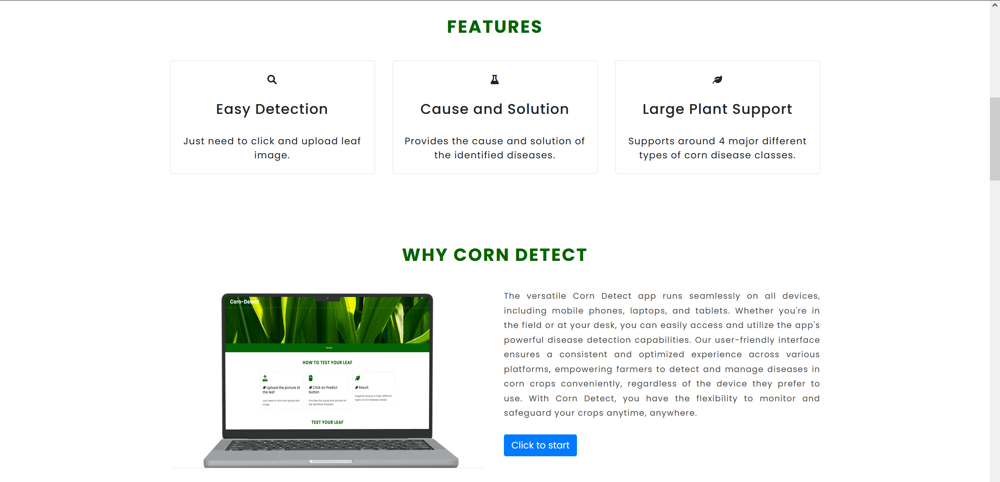
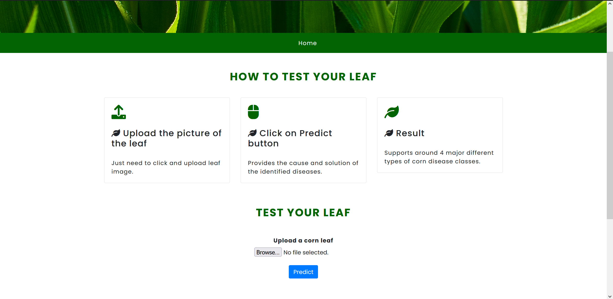

## Corn Detect [Recognition of Plant Diseases by Leaf Image Classification]

 

## Description

 The versatile Corn Detect app runs seamlessly on all devices, including mobile phones, laptops, and tablets. Whether you're in the field or at your desk, you can easily access and utilize the app's powerful disease detection capabilities. Our user-friendly interface ensures a consistent and optimized experience across various platforms, empowering farmers to detect and manage diseases in corn crops conveniently, regardless of the device they prefer to use. With Corn Detect, you have the flexibility to monitor and safeguard your crops anytime, anywhere.

   

This project is an approach to the development of corn disease recognition model, based on corn leaf image classification, by the
use of deep convolutional networks. The developed model is able to recognize 4 different types of corn diseases.
## Leaf Image Classification

  

 

   
 
1. Data gathering

   The dataset taken was **"kaggle"**. It can be downloaded through the link "https://www.kaggle.com/vipoooool/new-plant-diseases-dataset". It is an Image dataset containing images of different healthy and unhealthy crop leaves.

2. Model building

   - I have used pytorch for building the model.
   - I used three models:-
     1. The CNN model architecture consists of CNN Layer, Max Pooling, Flatten a Linear Layers.
     2. Using Transfer learning VGG16 Architecture.
     3. Using Transfer learning resnet34 Architecture.

3. Training

   The model was trained by using variants of above layers mentioned in model building and by varying hyperparameters. The best model was able to achieve 98.42% of test accuracy.

4. Testing

   The model was tested on total 17572 images of 38 classes. 
   The model used for prediction on sample images. It can be seen below:
   <!--  -->
   

  
   

5. Various Model Architecture tried along with Learning Rate and Optimizer and various accuracy obtained with different models.

  

  

## Details about the model

### The model will be able to detect `38` types of `diseases` of `14 Unique plants`

- The detail list of plants and diseases can be seen in [List](Src)

## Further Work:

- Implementing Image Localisation to find the excat position of the leaf affected .
- Building Recommender system for recommendation of proper presticides and control method for the disease.
- Implementing the appropriate management strategies like fungicide applications and pesticide applications could lead to early
  information on crop health and disease detection.This could facilitate the control of diseases and improve productivity.

## Usage:

- `Flask` : Code for Flask Server and deployment
- `TestImages` : Sample image for model testing
- `Src` : All The source code for building models
- `Models` : All the Pretrained Models of Pytorch

## License

This project is Licensed under `MIT`

## Explanation

#To understand the code :` You can find the complete explanation to the code in [Article](https://medium.com/@soumyajit4419/plant-ai-c8fc95ed90e6?  
# source=friends_link&sk=4707825cbaefa2dcaaa92d0e3ed5de01)

### Show your support

Give a ⭐ if you like this website!

 
